  

<b>C# developer building creative tools: graphics, sound, and games.</b> 
I like turning code into things you can see, hear and play.

  
  
  
  
  

### 🎨 [DanaProcessing](https://github.com/BuddhaCodes/DanaProcessing)

Creative coding in C#, the Processing way. It started because I wanted Processing / p5.js in C#, and grew into its own thing:

* Its own IDE: live diagnostics, under-a-second Run, and hot reload that keeps your sketch's state
* 2D and real 3D: SkiaSharp and OpenGL, up to 200,000 GPU particles
* Live-coded sound: an audio engine inspired by Sonic Pi, written from scratch: `[LiveLoop]`, synths, drums, and visuals that react on the beat
* Any NuGet package as a sketch library: one `// nuget:` comment and it's linked

[Docs](https://buddhacodes.github.io/DanaProcessing/) · [Download](https://github.com/BuddhaCodes/DanaProcessing/releases/latest) · MIT

### ⚫⚪ [Hoshi 星 (BadukDana)](https://github.com/BuddhaCodes/BadukDana)

A Go (baduk, weiqi) board that feels every move. It started because I wanted a Sabaki-like board in Avalonia, and grew into a place to play, study and review:

* A board you want to look at: kaya, bamboo and walnut gobans, clam-shell, yunzi and glass stones, all rendered from code, mixable with five themes
* KataGo in the background: every move rated with points lost, territory, a score graph, and a review of every game you've played
* Joseki on the board: the known continuations in every corner from the OGS Joseki Explorer, plus a spaced-repetition trainer
* Moves you can feel: the best move cracks the wood, captures shatter, and a lo-fi soundtrack synthesised in code heats up with your streaks
* Online on OGS, with fair play built in: no AI help during live games

[Website](https://buddhacodes.github.io/BadukDana/) · [Download](https://github.com/BuddhaCodes/BadukDana/releases/latest) · Windows · macOS · Linux

### 📊 Activity

   
   
  

Open to feedback, ideas and collaboration. If you build something with these, I'd love to see it.

